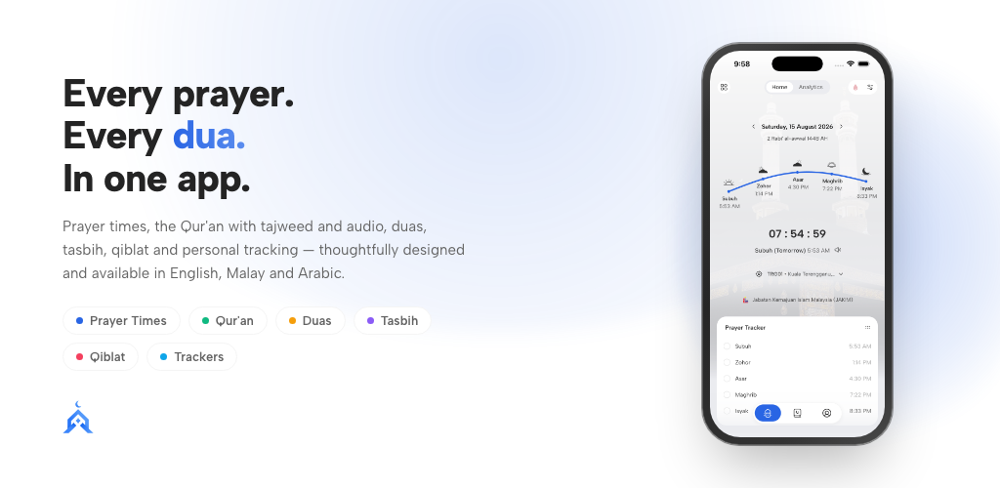

# Qawwam

### Every prayer. Every dua. In one app.

A complete Islamic companion for daily worship — prayer times, the Qur'an with tajweed and
audio, duas, tasbih, qiblat compass and personal trackers, thoughtfully designed and
available offline in English, Malay and Arabic.

 

 

## Everything you need to stay connected

| | | |
| :---: | :---: | :---: |
| 🕋 **Qur'an** — read the mushaf with tajweed colouring, translations, transliteration and audio recitation | 🕌 **Prayer Times** — accurate Waktu Solat from official authorities (JAKIM, Kemenag, MUIS, KHEU) with a time-aware progress arc | 🤲 **Duas** — a categorised library of supplications with Arabic, translation and transliteration |
| 📿 **Tasbih** — digital counter with curated adhkar, vibration feedback and per-dhikr targets | 🧭 **Qiblat** — smooth compass that points to the Kaabah from anywhere | 🗓️ **Islamic Events** — key dates with Hijri and Gregorian dates for the year ahead |
| 💖 **Prayer & Fasting Trackers** — log your daily worship, track streaks and review consistency | 📊 **Analytics** — beautiful charts of your Qur'an reading, prayer and fasting habits | 🌙 **Asma-ul-Husna** — explore the 99 Beautiful Names of Allah |
| 🩸 **Menstrual Tracker** — log haid and istihadah days with cycle predictions and smart reminders | 🌍 **3 Languages** — fully localised in English, Bahasa Malaysia and Arabic | ✨ **More to come** |

 

## Available soon

- **iOS & Android** — the app is coming to the App Store and Google Play. Stay tuned.
- Visit the **landing page** at [qawwam-landing.pages.dev](https://qawwam-landing.pages.dev/).

 

Made with ❤️ for the ummah

© 2026 Qawwam

